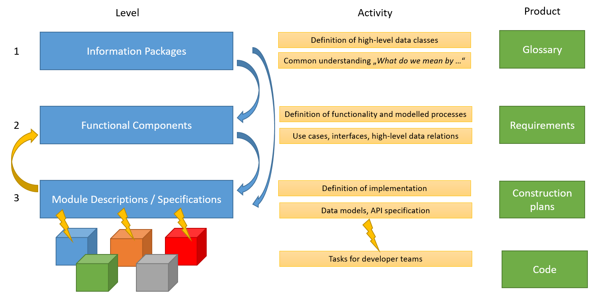

# About models in DINA

Natural history collections have multiple roles in education, research and cultural life. To fulfill these roles a multitude of curatorial and managerial tasks in natural history collections need to be performed in an effective manner. Software systems for supporting those tasks have become an indispensable part of natural history collection management.

In that, a **key functionality** of collection management software is the ability to **generate, access and update data** about
+ collection objects, their properties and relations to other entities and
+ curatorial, scientific or other activities involving a given object

in structured, digital representations. An additional requirement is that these representations can be accessed computationally and integrated with other data sources.

**Models** are used to **specify the structure of those representations** and are the basis for designing and implementing corresponding software.

Several models are being developed and used in DINA. They differ with respect to their subject domain and their role in the application development.

## DINAMO
+ DINAMO is DINA's main conceptual model and specifies how collection items, their properties and relations to other entities are represented on a foundational level. Its main design principle is the [process- and state-based representation of object histories](https://doi.org/10.3897/biss.5.75178). DINAMO is an abstract model, i.e. independent of any specific implementation.

The main model is complemented by models of curatorial processes that change a collection object physically or update knowledge about it. These are analytical models of particular types of processes in an object's history, e.g., collecting, accessioning, preserving, subsampling, or relocating an object.
and of the participants in these processes, e.g., persons, corporate entities, material entities, an object states at the start and the end of a process.

These analytical models inform the design of software components and user interfaces and their implementation in DINA. The also form the basis of mappings to other data models.

# Segmenting the model space for application development: Information Packages, Functional Component Descriptions and Module Descriptions

Approach for breaking down the DINA work and architecture from content-driven high-level concepts (Information Packages) to lower-level functionality-oriented components.

* __[Information Packages](information_packages/)__ make up the information model. Information Packages should be logically standalone, thus independent from other Information Packages.  
  * It addresses the question _Which information lives where?_ 
  * The Information Packages are not expected to change too much over time.

* For each Information Package one to many __[Functional Components](component_descriptions/)__ are described. Although a component description should already focus on functionality, the technical implementaion should play only a minor role. Rather the component description should be high-level and focussed on the accomplishment of use cases and workflows. 
  * It addresses the question _Which functionality needs to be considered per component?_
  
* From the functional component descriptions __module descriptions__ can be derived. 
  * It should be possible to develop a data model from the module descriptions. 
  * The module descriptions should be versioned (different MVPs) and are expected to be modified for each MVP.
  * Each module description links to a dedicated __specification repository__ in which the backlog for the implementation will be documented (e.g. API endpoints, software stack, data schema etc.)
  * It addresses the question _How to implement the desired informationa and functionality?_

The above-mentioned three levels should not be mixed.

# Existing Information Packages

* [collection objects](information_packages/collection_objects.md)

